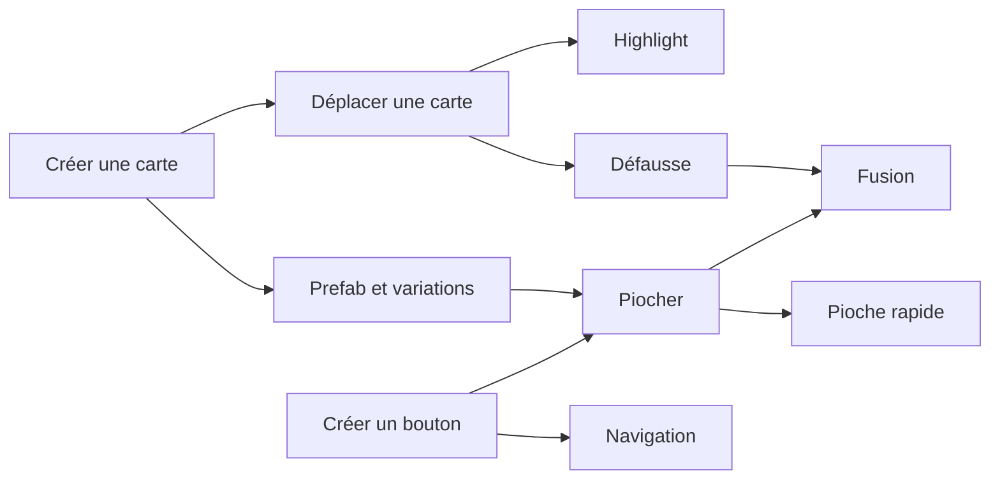

```mermaid
graph LR
	A[Créer une carte] --> B[Déplacer une carte]
	B --> C[Highlight]
	B --> D[Défausse]
	D --> E[Fusion]
	A --> G[Prefab et variations]
	G --> H[Piocher]
	H --> E
	H --> I[Pioche rapide]
	J[Créer un bouton] --> H
	J --> L[Navigation]
```
